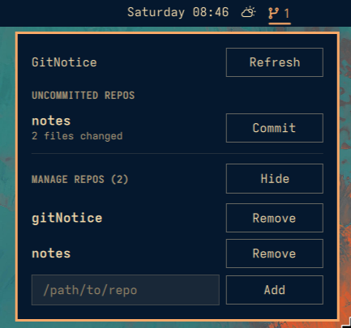

# GitNotice

An Omarchy 4 bar-widget plugin. Add the local paths of your git repos (your
notes vault, side projects, etc.) and GitNotice watches them for uncommitted
changes.

- A git-branch glyph sits in the bar. It uses the bar's foreground colour at
  reduced opacity when every tracked repo is clean, and uses the active bar
  accent colour with a count (N) when N repos have uncommitted changes.
- Click the icon to open the panel: it lists only the dirty repos with how
  many files changed in each, plus a manual **Refresh** button next to the
  heading if you don't want to wait for the periodic check.
- Pick a repo, type a commit message, hit **Push** — GitNotice runs
  `git add -A && git commit -m "…" && git push` for you.
- A collapsible "Manage repos" section lets you add new repo paths or remove
  ones you no longer want tracked.
- The panel content scrolls (instead of overflowing) once the repo list gets
  long.

## Screenshot

## How it works

All the git plumbing lives in [`gitnotice.sh`](gitnotice.sh), a small bash +
jq helper invoked from QML via `Quickshell.Io.Process`. It keeps the tracked
repo list in `~/.config/gitnotice/repos.json` and always prints JSON, so the
QML side (`BarWidget.qml` / `Panel.qml`) never touches the filesystem or git
directly. Requires `bash`, `git`, and `jq` — all ship with Omarchy by default.

`BarWidget.qml` re-runs `gitnotice.sh list` on a timer (default every 120s,
configurable via the widget's settings) and also on demand — via the panel's
Refresh button or the `sudhakar.gitnotice refresh` IPC call. The bar glyph
colour follows the current bar theme: clean uses the bar foreground with 60%
opacity, while dirty uses the active accent colour.

## Install
> omarchy plugin add https://github.com/sudhakarkarunaiprakasam/gitNotice --enable

## Uninstall
> omarchy plugin remove https://github.com/sudhakarkarunaiprakasam/gitNotice